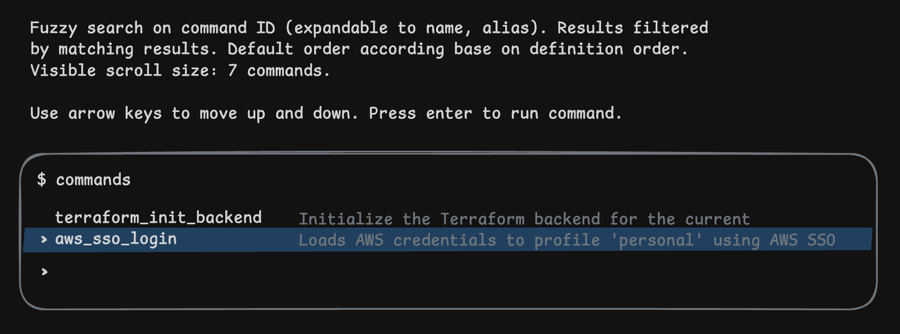

# Commands - Never have to keep documentation any more for your project commands

## Motivation

After years of experience working across different companies and teams with unique setups, there was a particular moment that I always felt was unnecessarily inneficient: running commands. And by that I don't in fact mean the step of running a command, but all of the other steps it takes in between to discover or remember what that command or sequence of comands is.

Working on software projects requires you to do any of the following at some point:
    build, deploy, run custom scripts, run tests, load credentials and/or authenticating against third-party providers, run locally..

And you could argue you remember every one of these commands for your project(s). And that's fine. I used to do as well. But remembering all commands by heart stops being reasonable when you work across multiple different repositories, managed by different teams/customers, with different ways of working, on different tech stacks. That's why teams create supporting documentation. However, without standardization, the documentation does not solve the problem, it just shifts it: from "What's the command" to "What's the document that contains the commands".

Efficient Context Switching therefore requires a standardized process that serves project-specific commands under a unified interface.

## Intro

Commands is a terminal-based application from where you can list and run project-scoped commands.

It is designed for collaborative work, with command definitions committed to version control under a `commands.yaml` file that lives at the root of your project.

## Usage

1. Install

Commands can be installed with most popular package managers: Homebrew, npm, (windows solution)
```sh
brew install commands
npm install -D commands
```

2. `commands.yaml`

These definitions should be placed at a `commands.yaml` file at the root of your project.

```yaml
Version: 1.0

Commands:

  terraform_init_backend:
    Description: Initialize the Terraform backend for the current environment
    Command: terraform chdir init -backend-config="./environments/$TARGET_ENV/config.tfbackend"
```

3. Run `commands`

```sh
commands
```



You must run Commands in the path where your `commands.yaml` is. Executed commands run relative to that path. 

See [spec](#spec) for the full commands file spec. 

## Spec

See [spec.yaml](../specs/v1.0/spec.yaml) for the latest official Commands specification.

## FAQ

### How does it compare to aliases ?

Commands offers the same functionality of aliases and beyond.

What I found is that with aliases you still have to remember the command alias or be inspecting the `.zsh` file everytime you need to look it up. Commands is there to help you when you don't remember what the command or alias is.

Secondly, Commands is designed for collaborative work, and targeted (scoped) on a per-project basis. This isolation means the same command identifier can execute different commands, saving you from ugly workarounds you'd need for globally-scoped command aliases:

```sh
# with Commands

# ~/projects/my_project/commands.yaml
# ~/projects/my_other_project/commands.yaml
tf_init

# with global aliases

# ~/aliases
tf_init_my_project
tf_init_my_other_project
```

It also means that your commands are stored alongside your project in version control, making sharing easier and providing a backup path for restoring your working environment.